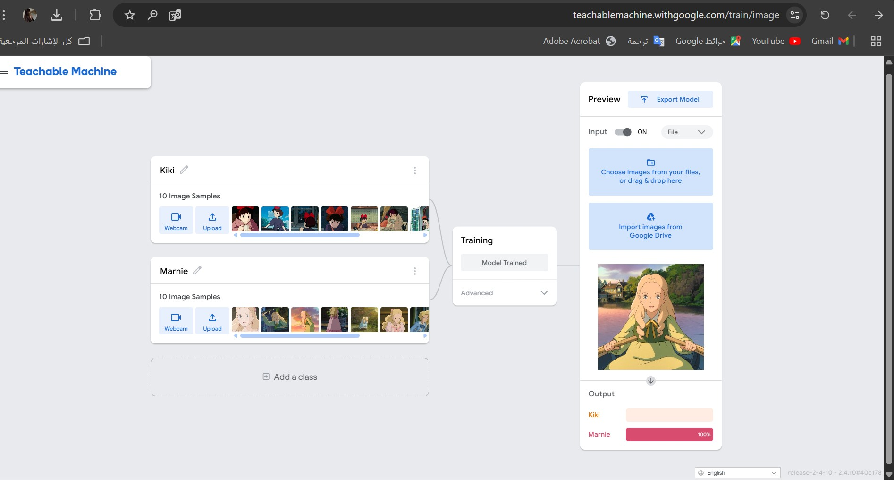
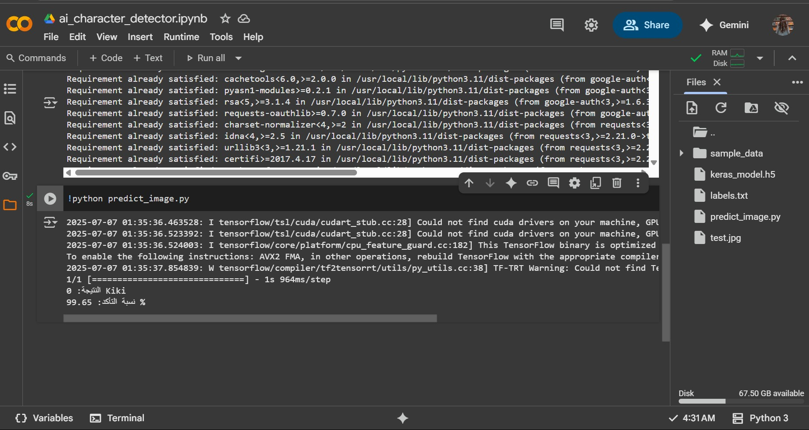

# AI Character Detector

تم تنفيذ هذا المشروع باستخدام Teachable Machine من Google ونموذج Keras لتمييز شخصيتين من أفلام Studio Ghibli:  
- Kiki من فيلم "Kiki's Delivery Service"  
- Marnie من فيلم "When Marnie Was There"

## الأدوات المستخدمة:
- Teachable Machine
- TensorFlow / Keras
- Python
- Google Colab

## محتويات المشروع:
- `keras_model.h5`: النموذج المدرب
- `labels.txt`: أسماء التصنيفات
- `predict_image.py`: سكربت التنبؤ باستخدام الصورة
- `test.jpg`: صورة مجربة على النموذج

## نتيجة التنبؤ:
تم اختبار صورة للشخصية "Kiki" وحصلنا على نتيجة دقيقة بنسبة **99.65%**.

## صورة من النتيجة:
(ارفقي صورة من نتيجة كولاب لو حبيتي)

---

## تنبيهات:
> يرجى تشغيل الأمر التالي في Google Colab قبل تجربة السكربت:

```python
!pip install tensorflow==2.12.1

## Screenshots

### 📌 Teachable Machine Training


### 📌 Google Colab Inference
